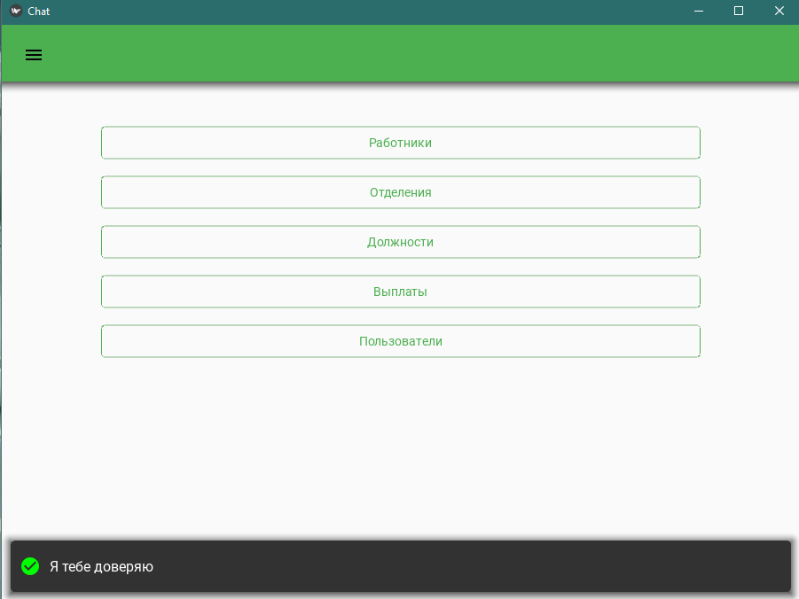

# Практическая работа №8 #

### Тема: Создание простых форм. Запись и чтение результатов из файла###

### Цель: Применить навыки создание форм и работы с файлами  ###

#### Ход работы ####

##### Задача: #####

Реализуйте анкету продажи товара

##### Контрольный пример: #####

1. Пользователь запускает программу
2. Выбирает Создать анкету
3. Вводит данные в поля
4. Нажимает кнопку Подтвердить
5. Сверху нажимает кнопку Посмотр анкеты


##### Системный анализ: #####

> Входные данные: `str: cdelet, emp_no, salary, from_date, to_date`  
> 
> Промежуточные данные: `-`
> 
> Выходные данные `str x`

##### Блок схемы: #####


##### Код python: #####
```python
from kivy.config import Config
Config.set("graphics", "width", 900)
Config.set("graphics", "height", 650)

import ntsecuritycon
from kivymd.uix.chip import MDChip
from kivy.animation import Animation
from kivymd.app import MDApp
from kivy.lang import Builder
import pymysql
from kivy.properties import StringProperty, ListProperty
from kivymd.uix.snackbar import BaseSnackbar
from kivy.core.window import Window
from pymysql.cursors import DictCursor

from hashlib import pbkdf2_hmac
from os import urandom
from kivymd.uix.screen import MDScreen
from kivymd.uix.datatables import MDDataTable
from kivymd.uix.dialog import MDDialog
from kivymd.uix.boxlayout import MDBoxLayout
from kivymd.uix.card import MDCard, MDCardSwipe
from kivymd.uix.boxlayout import BoxLayout
from kivymd.uix.button import MDFlatButton
from kivymd.uix.menu import MDDropdownMenu
from kivymd.uix.label import MDLabel
from kivymd.uix.progressbar import MDProgressBar
from kivy.clock import Clock


class Content(BoxLayout):
    pass

class Content2(BoxLayout):
    pass

class Content3(BoxLayout):
    pass

class Content4(BoxLayout):
    pass


class SwipeToDeleteItem(MDCardSwipe):
    text = StringProperty()

class SwipeToDeleteItem2(MDCardSwipe):
    text = StringProperty()

class MyChip(MDChip):
    icon_check_color = (0, 0, 0, 1)
    text_color = (0, 0, 0, 0.5)
    _no_ripple_effect = True

    def __init__(self, **kwargs):
        super().__init__(**kwargs)
        self.bind(active=self.set_chip_bg_color)
        self.bind(active=self.set_chip_text_color)

    def set_chip_bg_color(self, instance_chip, active_value: int):
        self.md_bg_color = (
            (0, 0, 0, 0.4)
            if active_value
            else (
                self.theme_cls.bg_darkest
                if self.theme_cls.theme_style == "Light"
                else (
                    self.theme_cls.bg_light
                    if not self.disabled
                    else self.theme_cls.disabled_hint_text_color
                )
            )
        )

    def set_chip_text_color(self, instance_chip, active_value: int):
        Animation(
            color=(0, 0, 0, 1) if active_value else (0, 0, 0, 0.5), d=0.2
        ).start(self.ids.label)


class MD3Card(MDCard):
    def __init__(self,emp_no:int,dolj:str,secname:str,name:str,gender:str,hr_date:str,manager:str,dep:str ,*args,**kwargs):
        self.emp_no =emp_no
        self.dolj = dolj
        self.secname=secname
        self.name = name
        self.gender = gender
        self.hr_date =hr_date
        self.manager = manager
        self.dep = dep
        super().__init__(*args,**kwargs)

class MD4Card(MDCard):
    def __init__(self,dept_no:int,dept_name:str,count:int,man:str ,*args,**kwargs):
        self.dept_no =dept_no
        self.dept_name = dept_name
        self.count = count
        self.man = man
        super().__init__(*args,**kwargs)


class CSnackbar(BaseSnackbar):
    icon = StringProperty(None)
    text = StringProperty(None)
    color = ListProperty(None)

class ChatApp(MDApp):
    def filt(self,x):
        self.screen.ids.box.clear_widgets()
        self.conn.commit()
        for instance_chip in self.screen.ids.chip_box.children:
            if instance_chip.active:
                dep = instance_chip.text
                query = f"SELECT employees.*, departments.dept_name,titles.title FROM dept_emp JOIN departments ON departments.dept_no=dept_emp.dept_no JOIN employees ON employees.emp_no = dept_emp.emp_no JOIN titles ON titles.emp_no = dept_emp.emp_no WHERE departments.dept_name=%s LIMIT {x},{6}"
                cursor = self.conn.cursor()
                cursor.execute(query, (dep,))
                result = cursor.fetchall()

                cursor.execute(
                    f'select emp_no,dept_manager.dept_no,departments.dept_name from dept_manager, departments where dept_manager.dept_no=departments.dept_no')
                result4 = cursor.fetchall()

                for emp in result:

                    self.screen.ids.box.add_widget(
                        MD3Card(emp_no=emp['emp_no'], dolj=emp['title'], secname=emp['last_name'],
                                name=emp['first_name'], gender=emp['gender'], hr_date=emp['hire_date'],
                                manager='-', dep=emp['dept_name']))
                    for emp2 in result4:
                        if emp2['emp_no'] == emp['emp_no']:
                            self.screen.ids.box.add_widget(
                                MD3Card(emp_no=emp['emp_no'], dolj=emp['title'], secname=emp['last_name'],
                                        name=emp['first_name'], gender=emp['gender'], hr_date=emp['hire_date'],
                                        manager=emp2['dept_name'], dep=emp['dept_name']))


    def removes_marks_all_chips(self):
            for instance_chip in self.screen.ids.chip_box.children:
                if instance_chip.active:
                    instance_chip.active = False
                    self.refresh_emp(0)

    def build(self):
        self.conn = pymysql.connect(
            host='localhost', #10.49.22.231
            user='root',  #test
            password='root',  #test
            database='employees',
            cursorclass=DictCursor
        )
        if not self.conn:

            self.stop()
        self.i =0
        self.prev_row = None
        self.prikol = 0
        self.prikol2 = 0
        self.prikol3 = 0
        self.hahaha = 6
        self.dialog2 = None
        self.dialog = None
        self.dialog3 = None
        self.dialog4 = None
        self.dialog5 = None
        self.screen = Builder.load_file('ui.kv')

        table = MDDataTable(
            use_pagination=True,
            rows_num=5,
            check=True,
            pagination_menu_pos='center',
            column_data=[
                ('Номер', 60),
                ('Фамилия', 60),
                ('Имя', 60),
                ('Выплата',60),
                ('С даты',60),
                ('По дату',60)
            ]
        )

        table.bind(on_row_press=self.on_row_press)

        self.theme_cls.primary_palette = 'Green'
        self.screen.ids.lt_table_chat.add_widget(table)

        with self.conn.cursor() as cursor:
            cursor.execute(f'select count(*) from users where role={1} OR role = {2}')
            result = cursor.fetchall()

        if result[0]['count(*)'] != 0 :
            self.screen.ids.reg_b.disabled = True
        else:
            self.screen.ids.reg_b.disabled = False
        self.user = {
            'id': self.config.get('Session', 'id'),
            'login': self.config.get('Session', 'login'),
            'token':self.config.get('Session', 'token')
        }
        self.msg_refresh=None
        if not self.user['id'] != None:
            self.screen.current = 'login'

        self.theme_cls.primary_palette = 'Green'

        return self.screen

    def on_row_press(self, table, row):
        if row.ids.check.active:
            row.ids.check.active = False
        else:
            if not self.prev_row is None:
                self.prev_row.ids.check.active = False
            row.ids.check.active = True
            self.prev_row = row


    def refresh_table(self,x):
        self.conn.commit()
        with self.conn.cursor() as cursor:
            cursor.execute(f'SELECT salaries.*,employees.first_name, employees.last_name FROM salaries JOIN employees ON employees.emp_no = salaries.emp_no  LIMIT {x},50')
            result = cursor.fetchall()

        self.screen.ids.lt_table_chat.children[0].row_data = []
        for row in result:

            self.screen.ids.lt_table_chat.children[0].add_row((
                row['emp_no'],
                row['last_name'],
                row['first_name'],
                row['salary'],
                row['from_date'],
                row['to_date'],

            ))


    def search(self):
        self.conn.commit()
        with self.conn.cursor() as cursor:
            cursor.execute(f'SELECT salaries.*,employees.first_name, employees.last_name FROM salaries JOIN employees ON employees.emp_no = salaries.emp_no WHERE salaries.from_date >="{self.screen.ids.p_sdate.text}" and salaries.to_date<="{self.screen.ids.p_pdate.text}" LIMIT 0,50')
            result = cursor.fetchall()

        self.screen.ids.lt_table_chat.children[0].row_data = []
        for row in result:

            self.screen.ids.lt_table_chat.children[0].add_row((
                row['emp_no'],
                row['last_name'],
                row['first_name'],
                row['salary'],
                row['from_date'],
                row['to_date'],

            ))


    def add_row(self):
        global cdelet

        if cdelet == 3:
            self.add_notify('e', 'Нет прав')
            return

        self.emp_no = self.dialog3.content_cls.ids.p_emp.text
        self.salary = self.dialog3.content_cls.ids.p_salary.text
        self.from_date = self.dialog3.content_cls.ids.p_fdate.text
        self.to_date = self.dialog3.content_cls.ids.p_tdate.text
        if self.emp_no and self.salary and self.from_date and self.to_date != '':
            try:
                with self.conn.cursor() as cursor:
                    cursor.execute(f'insert into salaries (`emp_no`, `salary`, `from_date`,`to_date`) values'
                                       f' ("{self.emp_no}", {self.salary}, "{self.from_date}", "{self.to_date}")')
                    self.refresh_table(0)
                    self.add_notify('s', 'Добавлено')
                    self.dialog3.dismiss()
                    cnt = self.dialog3.content_cls.ids
                    cnt.p_emp.text = ''
                    cnt.p_salary.text = ''
                    cnt.p_fdate.text = ''
                    cnt.p_tdate.text = ''
            except (Exception):
                self.add_notify('e','Ищи ошибки, но скорее всего не правильная дата попробуй (1999-01-01)')
        else:
            self.add_notify('e','Пустое поле')

        self.conn.commit()


    def edit_row(self):
        global cdelet

        if cdelet == 3:
            self.add_notify('e', 'Нет прав')
            return
        table = self.screen.ids.lt_table_chat.children[0]
        row = table.get_row_checks()[0]
        self.prev_row.ids.check.active = False
        self.emp_no = self.dialog3.content_cls.ids.p_emp.text
        self.salary = self.dialog3.content_cls.ids.p_salary.text
        self.from_date = self.dialog3.content_cls.ids.p_fdate.text
        self.to_date = self.dialog3.content_cls.ids.p_tdate.text
        if self.emp_no and self.salary and self.from_date and self.to_date != '':
            with self.conn.cursor() as cursor:
                cursor.execute(f'UPDATE salaries SET `emp_no`="{self.emp_no}", `salary`={int(self.salary)}, `from_date`="{self.from_date}",`to_date`="{self.to_date}" WHERE emp_no={row[0]} AND salary={row[3]}')
                self.refresh_table(0)
                self.add_notify('s', 'Изменено')
                self.dialog3.dismiss()
                cnt = self.dialog3.content_cls.ids
                cnt.p_emp.text = ''
                cnt.p_salary.text = ''
                cnt.p_fdate.text = ''
                cnt.p_tdate.text = ''

        self.conn.commit()

    def del_row(self):
        global cdelet

        if cdelet == 3 or 2:
            self.add_notify('e', 'Нет прав')
            return
        table = self.screen.ids.lt_table_chat.children[0]
        row = table.get_row_checks()[0]
        self.prev_row.ids.check.active = False
        with self.conn.cursor() as cursor:
            cursor.execute(f'delete from salaries where emp_no = "{row[0]}" AND salary = {row[3]}')
        self.conn.commit()
        self.add_notify('s', 'Удалено')
        self.refresh_table(0)

    def add_notify(self, types: str, text: str):
        # cancel alert-circle check-circle
        match types:
            case 'e':
                icon = 'cancel'
                color = [1, 0, 0, 1]
            case 's':
                icon = 'check-circle'
                color = [0, 1, 0, 1]
            case _:
                icon = 'information'
                color = [1, 1, 0, 0]

        notify = CSnackbar(
            text=text,
            icon=icon,
            snackbar_x=10,
            snackbar_y=10,
            color=color
        )

        notify.size_hint_x = ((Window.width - 20) / Window.width)
        notify.open()

    def build_config(self, config):
        config.setdefaults(
            'Session', {
                'id': 'None',
                'login': 'None',
                'token': 'None'
            }
        )

    def login(self, login: str, password: str):
        global cdelet
        with self.conn.cursor() as cursor:
            cursor.execute(f'select * from users where login="{login}"')
            result = cursor.fetchone()

            if not result:
                self.add_notify('e', 'Не правильное или то или другое')
                return
            else:
                password_old = result['password'].encode('latin1').decode('unicode-escape').encode('latin1')
                salt = password_old[:6]
                password = pbkdf2_hmac(
                    'sha256',
                    password.encode('utf-8'),
                    salt,
                    10000,
                    16
                )
                if password_old[6:] == password:
                    self.config.set('Session', 'id', result['id'])
                    self.config.set('Session', 'login', result['login'])

                    self.config.write()
                    self.user = {
                        'id': self.config.get('Session', 'id'),
                        'login': self.config.get('Session', 'login'),

                    }
                    cdelet = result['role']


                    self.add_notify('s', 'Я тебе доверяю')
                    self.screen.current = 'chat'
                    self.screen.ids.sm_main.current='main'

                else:
                    self.add_notify('e', 'Не правильное или то или другое')


    def reg(self, login: str, password1: str, password2: str):
        if password1 != password2:
            self.add_notify('e', 'Пароли не совпадают')
            return
        try:

            password = self.hash_password(password1, urandom(6))

            with self.conn.cursor() as cursos:

                cursos.execute(f'insert into  users (login, password, role,emp_no, active) values ("{login}", "{password[1]}",2,null,true)')
            self.conn.commit()
            self.add_notify('s', 'Вы успешно зарегестрировались!')


        except:
            self.add_notify('e', 'Ошибка. Проверьте данные.')

    def logout(self):
        self.user = {'id': 'None',
                     'login': 'None',
                     'token':'None'}
        self.config.set('Session', 'id', 'None')
        self.config.set('Session', 'login', 'None')
        self.config.set('Session', 'token', 'None')
        self.config.write()
        self.screen.current = 'login'


    def hash_password(self, password: str, salt: bytes = None):

        if salt is None:
            salt = urandom(6)
        p_hash = salt + pbkdf2_hmac(
            'sha256',
            password.encode('utf-8'),
            salt,
            10000,
            16
        )

        p_sql = str(p_hash).replace('\\', '\\\\')[2:-1]
        return [p_hash, p_sql]

    def str_to_bytes(self, p_hash: str):
        return p_hash.encode('latin1').decode('unicode-escape').encode('latin1')


    def refresh_emp(self,x):
        self.screen.ids.box.clear_widgets()
        self.conn.commit()
        with self.conn.cursor() as cursor:
            print(x)
            cursor.execute(f'select * from employees limit {x},{self.hahaha}')

            result= cursor.fetchall()
            cursor.execute(f'select emp_no,dept_manager.dept_no,departments.dept_name from dept_manager, departments where dept_manager.dept_no=departments.dept_no')
            result4=cursor.fetchall()

            for emp in result:
                cursor.execute(f'select title from titles where emp_no={emp["emp_no"]}')
                result2 = cursor.fetchall()
                cursor.execute(f'select dept_emp.`dept_no`, departments.`dept_name` as `dep_name` from dept_emp INNER JOIN departments ON (dept_emp.`dept_no`=departments.`dept_no`) where dept_emp.`emp_no`={emp["emp_no"]}')
                result3 = cursor.fetchall()
                self.screen.ids.box.add_widget(MD3Card(emp_no=emp['emp_no'], dolj=result2[0]['title'],secname=emp['last_name'],
                                                       name=emp['first_name'],gender=emp['gender'],hr_date=emp['hire_date'],
                                                       manager='-',dep=result3[0]['dep_name']))
                for emp2 in result4:
                    if emp2['emp_no']==emp['emp_no']:
                        self.screen.ids.box.add_widget(
                            MD3Card(emp_no=emp['emp_no'], dolj=result2[0]['title'], secname=emp['last_name'],
                                    name=emp['first_name'], gender=emp['gender'], hr_date=emp['hire_date'],
                                    manager=emp2['dept_name'], dep=result3[0]['dep_name']))


    def refresh_dep(self,x):
        self.screen.ids.box2.clear_widgets()

        self.conn.commit()
        with self.conn.cursor() as cursor:
            cursor.execute(f'select * from departments limit {x},{self.hahaha}')

            result= cursor.fetchall()


            for dept in result:
                cursor.execute(f'select count(*) from dept_emp where dept_no = "{dept["dept_no"]}"')
                result4 = cursor.fetchall()
                cursor.execute(f'select * from dept_manager where dept_no="{dept["dept_no"]}"')
                result2 = cursor.fetchall()

                self.screen.ids.box2.add_widget(MD4Card(dept_no=dept["dept_no"],dept_name=dept["dept_name"],count=result4[0]["count(*)"],man=result2[0]["emp_no"]))


    def next(self):
        self.count = 0
        if self.screen.current == 'emp':
            for instance_chip in self.screen.ids.chip_box.children:
                if instance_chip.active:
                    self.count +=1
            if self.count > 0 :
                self.prikol2 += 6
                self.filt(self.prikol2)
            else:
                self.prikol += 6
                self.refresh_emp(self.prikol)

        elif self.screen.current == 'otdel':
            self.prikol3 += 6
            self.refresh_dep(self.prikol3)


    def back(self):
        self.count = 0
        if self.screen.current == 'emp':
            for instance_chip in self.screen.ids.chip_box.children:
                if instance_chip.active:
                    self.count += 1
        elif self.screen.current == 'otdel':
            self.prikol3 -=6
            if self.prikol3 < 0:
                self.add_notify('e', 'Куда блять, ты жмау уже и так первая страница')
                self.prikol3 = 0
            else:
                self.refresh_dep(self.prikol3)

        if self.count > 0:
            self.prikol2 -= 6
            if self.prikol2 < 0:
                self.add_notify('e', 'Куда блять, ты жмау уже и так первая страница')
                self.prikol2 = 0
            else:
                self.filt(self.prikol2)
        else:
            self.prikol -= 6
            if self.prikol < 0:
                self.add_notify('e', 'Куда блять, ты жмау уже и так первая страница')
                self.prikol = 0
            else:
                self.refresh_emp(self.prikol)


    def delet(self,instance):
        global cdelet

        try:
            if cdelet == 2 or 3:
                self.add_notify('e','Нет прав')
                return
            self.hren = instance.ids.l_emp_no.text.split(' ')

            with self.conn.cursor() as cursor:
                cursor.execute(f'delete from employees where emp_no={self.hren[1]}')
            self.add_notify('s', 'Удалено')
            self.refresh_emp(self.prikol)

        except Exception as error:
            self.add_notify('e', 'error')

    def on_start(self):
        self.collect=['Assistant Engineer','Engineer','Senior Engineer','Senior Staff','Staff','Technique Leader']

        for row in self.collect:
            card = SwipeToDeleteItem(
                text=f"{row}"
            )
            self.screen.ids.md_list.add_widget(card)

    def on_start2(self):
        self.screen.ids.md_list_2.clear_widgets()
        self.conn.commit()
        with self.conn.cursor() as cursor:
            cursor.execute(f'select users.login from users')
            result = cursor.fetchall()
            for row in result:
                card2 = SwipeToDeleteItem2(
                    text=f"{row['login']}"
                )
                self.screen.ids.md_list_2.add_widget(card2)

    def eqwe(self):
        global asd, zxc
        asd += 50
        self.spis(zxc)
    def spis(self,inst):
        global asd, zxc

        zxc = inst

        self.screen.ids.sm_main.current = 'spisok'
        self.spisok = inst.text
        with self.conn.cursor() as cursor:
            cursor.execute(f'select employees.* from employees JOIN titles ON titles.emp_no=employees.emp_no WHERE titles.title = "{self.spisok}" LIMIT {asd},50')
            result = cursor.fetchall()
        for names in result:
            Label = MDLabel(
                text=f'{str(names["emp_no"])}. {str(names["first_name"])} {str(names["last_name"])} {str(names["gender"])} {str(names["birth_date"])}'
            )
            self.screen.ids.msg_box.add_widget(Label)


    def show_dialog(self):
        global cdelet
        if not self.dialog:
            self.dialog = MDDialog(
                title=f'Редактирование',
                content_cls=Content(),
                type="custom",
                buttons=[
                    MDFlatButton(
                        text='Потвердить',
                        theme_text_color='Custom',
                        text_color=self.theme_cls.accent_color,
                        on_press=lambda x: self.edit()

                    ),
                    MDFlatButton(
                        text='Закрыть',
                        theme_text_color='Custom',
                        text_color=self.theme_cls.accent_color,
                        on_press=lambda x: self.dialog.dismiss()
                    ),
                ],

            )


        if cdelet == 3:
            self.add_notify('e', 'Нет прав')
            return
        self.dialog.open()

    def show_dialog2(self):
        global cdelet

        if not self.dialog2:
            self.dialog2 = MDDialog(
                title=f'Редактирование',
                content_cls=Content2(),
                type="custom",
                buttons=[
                    MDFlatButton(
                        text='Потвердить',
                        theme_text_color='Custom',
                        text_color=self.theme_cls.accent_color,
                        on_press=lambda x: self.edit2()

                    ),
                    MDFlatButton(
                        text='Закрыть',
                        theme_text_color='Custom',
                        text_color=self.theme_cls.accent_color,
                        on_press=lambda x: self.dialog2.dismiss()
                    ),
                ],

            )
        if cdelet == 3:
            self.add_notify('e', 'Нет прав')
            return
        self.dialog2.open()


    def show_dialog3(self,g):
        global cdelet

        if not self.dialog3:

            self.dialog3 = MDDialog(
                title=f'{g}',
                content_cls=Content3(),
                type="custom",
                buttons=[
                    MDFlatButton(
                        text='Потвердить',
                        theme_text_color='Custom',
                        text_color=self.theme_cls.accent_color,

                        on_press=lambda x: self.add_row() if g == 'Добавление' else self.edit_row()

                    ),
                    MDFlatButton(
                        text='Закрыть',
                        theme_text_color='Custom',
                        text_color=self.theme_cls.accent_color,
                        on_press=lambda x: self.dialog3.dismiss()
                    ),
                ],

            )

        if cdelet == 3:
            self.add_notify('e', 'Нет прав')
            return
        self.dialog3.open()

    def test(self, instance):
        self.nomer = instance.ids.l_emp_no.text[3:]
        self.dialog.content_cls.ids.p_sname.text = instance.ids.l_secname.text[9:]
        self.dialog.content_cls.ids.p_name.text = instance.ids.l_name.text[5:]
        self.dialog.content_cls.ids.p_gender.text = instance.ids.l_gender.text[5:]
        self.dialog.content_cls.ids.p_dolj.text = instance.ids.l_dolj.text[11:]
        self.dialog.content_cls.ids.p_hr_date.text = instance.ids.l_hr_date.text[12:]
        self.dialog.content_cls.ids.p_manager.text = instance.ids.l_manager.text[16:]
        self.dialog.content_cls.ids.p_dep.text = instance.ids.l_dep.text[7:]


    def test2(self,instance):
        self.dialog2.content_cls.ids.p_id.text = instance.ids.l_dept_no.text[3:]
        self.dialog2.content_cls.ids.p_named.text = instance.ids.l_dept_name.text[14:]
        self.dialog2.content_cls.ids.p_kol.text = instance.ids.l_count.text[12:]
        self.dialog2.content_cls.ids.p_man.text = instance.ids.l_man.text[9:]
        self.stariy = instance.ids.l_man.text[9:]

    def test4(self,instance):
        global log_id
        self.l = instance.text
        with self.conn.cursor() as cursor:
            cursor.execute(f'select * from users  WHERE login = "{self.l}"')
            result = cursor.fetchall()

        match result[0]['role']:
            case 1:
                self.role2='admin'
            case 2:
                self.role2='manager'
            case 3:
                self.role2='employees'

        for row in result:
            log_id = row['id']
            self.dialog4.content_cls.ids.p_log.text = row['login']
            self.dialog4.content_cls.ids.p_role.text = self.role2
            self.dialog4.content_cls.ids.p_emp.text = str(row['emp_no'])


    def test3(self):
        table = self.screen.ids.lt_table_chat.children[0]
        row = table.get_row_checks()[0]

        self.dialog3.content_cls.ids.p_emp.text = row[0]
        self.dialog3.content_cls.ids.p_salary.text = row[3]
        self.dialog3.content_cls.ids.p_fdate.text =  row[4]
        self.dialog3.content_cls.ids.p_tdate.text = row[5]

    def edit2(self):
        global cdelet

        if cdelet == 3:
            self.add_notify('e', 'Нет прав')
            return

        self.man = self.dialog2.content_cls.ids.p_man.text
        self.num = self.dialog2.content_cls.ids.p_id.text
        self.count = self.dialog2.content_cls.ids.p_kol.text
        self.named = self.dialog2.content_cls.ids.p_named.text
        self.conn.commit()

        with self.conn.cursor() as cursor:
            cursor.execute(f'INSERT INTO titles (emp_no, title, from_date, to_date) VALUES ({self.man}, "Manager", "1996-02-11", "2000-12-18")')

        self.conn.commit()

        with self.conn.cursor() as cursor:
            cursor.execute(f'delete from dept_manager WHERE emp_no = {self.stariy}')

        self.conn.commit()

        with self.conn.cursor() as cursor:
            cursor.execute(f'delete from titles WHERE emp_no = {self.stariy} and title = "Manager"')

        self.conn.commit()

        with self.conn.cursor() as cursor:
            cursor.execute(f'INSERT INTO dept_manager (emp_no, dept_no, from_date, to_date) VALUES ({self.man}, "{self.num}", "1996-02-11", "2000-12-18")')
        self.refresh_dep(0)
        self.add_notify('s', 'Изменено')
        self.conn.commit()

    def edit(self):
        global cdelet

        if cdelet == 3:
            self.add_notify('e', 'Нет прав')
            return

        self.secname = self.dialog.content_cls.ids.p_sname.text
        self.names = self.dialog.content_cls.ids.p_name.text
        self.gender = self.dialog.content_cls.ids.p_gender.text
        self.dolj = self.dialog.content_cls.ids.p_dolj.text
        self.hr_date = self.dialog.content_cls.ids.p_hr_date.text
        self.manager = self.dialog.content_cls.ids.p_manager.text
        self.dep = self.dialog.content_cls.ids.p_dep.text
        match self.dep:
            case "Customer Service":
                self.Ndep = 'd009'
            case "Development":
                self.Ndep = 'd005'
            case "Finance":
                self.Ndep = 'd002'
            case "Human Resources":
                self.Ndep = 'd003'
            case "Marketing":
                self.Ndep = 'd001'
            case "Production":
                self.Ndep = 'd004'
            case "Quality Management":
                self.Ndep = 'd006'
            case "Research":
                self.Ndep = 'd008'
            case "Sales":
                self.Ndep = 'd007'
            case _:
                self.add_notify('e','Не существующий отдел!')
                return

        self.conn.commit()
        with self.conn.cursor() as cursor:
            cursor.execute(f'update employees set `last_name`="{self.secname}",`first_name`="{self.names}",`gender`="{self.gender}",`hire_date`="{self.hr_date}" where emp_no="{self.nomer}"')
            cursor.execute(f'update dept_emp set `dept_no`="{self.Ndep}" where `emp_no`="{self.nomer}"')
            cursor.execute(f'update titles set `title`="{self.dolj}" where `emp_no`="{self.nomer}"')
        self.refresh_emp(0)
        self.add_notify('s','Изменено')
        self.conn.commit()

    def switch_screen(self, screen):
        global asd
        #self.screen.ids.sm_auth.current = screen

        match screen:
            case 'main':
                self.screen.ids.sm_main.current = screen
            case 'emp':
                self.refresh_emp(0)
                self.screen.ids.sm_main.current = screen
            case 'otdel':
                self.refresh_dep(0)
                self.screen.ids.sm_main.current = screen
            case 'dolj':
                asd = 0
                self.screen.ids.msg_box.clear_widgets()
                self.screen.ids.sm_main.current = screen
            case 'Sell':
                self.refresh_table(0)
                self.screen.ids.sm_main.current = screen
            case 'user':
                self.on_start2()
                self.screen.ids.sm_main.current = screen

    def show_dialog4(self,instance):
        global cdelet

        if not self.dialog4:
            self.dialog4=MDDialog(
                title=f'Редактирование',
                content_cls=Content4(),
                type="custom",
                buttons = [
                    MDFlatButton(
                        text='Потвердить',
                        theme_text_color='Custom',
                        text_color=self.theme_cls.accent_color,
                        on_press=lambda x:  self.renote(instance)

                ),
                    MDFlatButton(
                        text='Закрыть',
                        theme_text_color='Custom',
                        text_color=self.theme_cls.accent_color,
                        on_press=lambda x: self.dialog4.dismiss()
                    ),
                ],

            )

        if cdelet == 3:
            self.add_notify('e', 'Нет прав')
            return

        self.dialog4.open()

    def show_dialog5(self):
        global cdelet

        if not self.dialog5:
            self.dialog5=MDDialog(
                title=f'Добавление',
                content_cls=Content4(),
                type="custom",
                buttons = [
                    MDFlatButton(
                        text='Потвердить',
                        theme_text_color='Custom',
                        text_color=self.theme_cls.accent_color,
                        on_press=lambda x:  self.adduser()

                ),
                    MDFlatButton(
                        text='Закрыть',
                        theme_text_color='Custom',
                        text_color=self.theme_cls.accent_color,
                        on_press=lambda x: self.dialog5.dismiss()
                    ),
                ],

            )
        if cdelet == 3:
            self.add_notify('e', 'Нет прав')
            return

        self.dialog5.open()

    def adduser(self):
        global cdelet

        if cdelet == 3:
            self.add_notify('e', 'Нет прав')
            return

        if self.dialog5.content_cls.ids.p_pas.text != self.dialog5.content_cls.ids.p_pas2.text:
            self.add_notify('e', 'Пароли не совпадают')
            return

        match self.dialog5.content_cls.ids.p_role.text:
            case 'admin':
                self.role = 1
            case 'manager':
                self.role = 2
            case 'employees':
                self.role = 3
            case _:
                self.add_notify('e','Такой роли нет')
                return


        password = self.hash_password(self.dialog5.content_cls.ids.p_pas.text, urandom(6))

        with self.conn.cursor() as cursos:
            cursos.execute(f'insert into users (login, password, role, emp_no) values ("{self.dialog5.content_cls.ids.p_log.text}","{password[1]}",{self.role},{self.dialog5.content_cls.ids.p_emp.text})')

        self.conn.commit()
        self.add_notify('s', 'Добавлено')


        self.add_notify('e', 'Ошибка. Проверьте данные.')

        self.on_start2()

    def renote(self,instance):
        global log_id, cdelet

        if cdelet == 3:
            self.add_notify('e', 'Нет прав')
            return

        if self.dialog4.content_cls.ids.p_pas.text != self.dialog4.content_cls.ids.p_pas2.text:
            self.add_notify('e', 'Пароли не совпадают')
            return

        match self.dialog4.content_cls.ids.p_role.text:
            case 'admin':
                self.role = 1
            case 'manager':
                self.role = 2
            case 'employees':
                self.role = 3
            case _:
                self.add_notify('e','Такой роли нет')
                return

        try:

            password = self.hash_password(self.dialog4.content_cls.ids.p_pas.text, urandom(6))

            with self.conn.cursor() as cursos:
                cursos.execute(f'update users set `login`="{self.dialog4.content_cls.ids.p_log.text}",`password`="{password[1]}", `role`={self.role}, emp_no = {self.dialog4.content_cls.ids.p_emp.text} where id="{log_id}"')

            self.conn.commit()
            self.add_notify('s', 'Изменено')


        except:
            self.add_notify('e', 'Ошибка. Проверьте данные.')

        self.on_start2()


    def delu(self,instance):
        global cdelet

        try:
            if cdelet == 2 or 3:
                self.add_notify('e','Нет прав')
                return
            if instance.text == self.config.get("Session","login"):
                self.add_notify('e','Самоудаление!')
                return
            self.work1 = instance.text
            with self.conn.cursor() as cursor:
                cursor.execute(f'delete from users where login="{self.work1}"')
            self.add_notify('s', 'Удалено')
            self.screen.ids.md_list.remove_widget(instance)
        except Exception as error:
            self.add_notify('e', 'error')

app = ChatApp()
app.run()


```
##### Код ui.kv: #####
```kivymd
<SwipeToDeleteItem>:
    size_hint_y:None
    height: content.height

    MDCardSwipeLayerBox:
        padding: "8px"


        MDIconButton:
            icon:'cog'
            pos_hint:{'center_y':.5}
            on_release:
                app.spis(root)


    MDCardSwipeFrontBox:
        OneLineListItem:
            id:content
            text:root.text
            _no_ripple_effect:True


<SwipeToDeleteItem2>:
    size_hint_y:None
    height: content.height

    MDCardSwipeLayerBox:
        padding: "8px"


        MDIconButton:
            icon:'pen'
            pos_hint:{'center_y':.5}
            on_release:
                app.show_dialog4(root)
                app.test4(root)

        MDIconButton:
            id:sd2_b
            icon:'trash-can'
            pos_hint:{'center_y':.5}
            on_release:
                app.delu(root)


    MDCardSwipeFrontBox:
        OneLineListItem:
            id:content
            text:root.text
            _no_ripple_effect:True


<CSnackbar>:
    MDIcon:
        icon: root.icon
        theme_text_color: 'Custom'
        text_color: root.color
        pos_hint:{'center_y':.5}

    MDLabel:
        text: root.text
        theme_text_color: 'Custom'
        text_color: [1,1,1,1]
        pos_hint:{'center_y':.5}

<MD3Card>
    md_bg_color:[.96,.96,.96,1]
    padding: 4
    size_hint: None, None
    size: "280dp", "225dp"


    MDBoxLayout:
        orientation:'vertical'
        size_hint:1,None
        height:self.minimum_height
        padding:20
        spacing:5
        MDBoxLayout:
            orientation:'horizontal'
            padding:[169,90,0,-40]
            MDIconButton:
                icon: "pen"
                pos_hint: {"right": 1}
                on_press:
                    app.show_dialog()
                    app.test(root)


            MDIconButton:
                id:m3_b
                icon: "delete"
                pos_hint: {"right": 1}
                on_press:
                    app.delet(root)


        MDLabel:
            id:l_emp_no
            text:f'№: {root.emp_no}'
            adaptive_height:True

        MDLabel:
            id:l_secname
            text:f'Фамилия: {root.secname}'
            adaptive_height:True
        MDLabel:
            id:l_name
            text:f'Имя: {root.name}'
            adaptive_height:True
        MDLabel:
            id:l_gender
            text:f'Пол: {root.gender}'
            adaptive_height:True
        MDLabel:
            id:l_dolj
            text:f'Должность: {root.dolj}'
            adaptive_height:True
        MDLabel:
            id:l_hr_date
            text:f'Дата найма: {root.hr_date}'
            adaptive_height:True
        MDLabel:
            id:l_manager
            text:f'Манагер отдела: {root.manager}'
            adaptive_height:True
        MDLabel:
            id:l_dep
            text:f'Отдел: {root.dep}'
            adaptive_height:True

<MD4Card>
    md_bg_color:[.96,.96,.96,1]
    padding: 4
    size_hint: None, None
    size: "280dp", "150dp"

    MDBoxLayout:
        orientation:'vertical'
        size_hint:1,None
        height:self.minimum_height
        padding:20
        spacing:5
        MDBoxLayout:
            orientation:'horizontal'
            padding:[169,90,0,-40]
            MDIconButton:
                icon: "pen"
                pos_hint: {"right": 1}
                on_press:
                    app.show_dialog2()
                    app.test2(root)

           # MDIconButton:
               # id:m4_b
               # icon: "delete"
               # pos_hint: {"right": 1}
               # on_press:
                    #app.delet(root)

        MDLabel:
            id:l_dept_no
            text:f'№: {root.dept_no}'
            adaptive_height:True

        MDLabel:
            id:l_dept_name
            text:f'Наименование: {root.dept_name}'
            adaptive_height:True
        MDLabel:
            id:l_count
            text:f'Количество: {root.count}'
            adaptive_height:True
        MDLabel:
            id:l_man
            text:f'Манагер: {root.man}'
            adaptive_height:True


<Content>
    orientation: "vertical"
    spacing: "12dp"
    size_hint_y: None
    height: "500dp"

    MDTextField:
        id:p_sname
        hint_text: "Фамилия"
        mode: 'rectangle'

    MDTextField:
        id:p_name
        hint_text: "Имя"
        mode: 'rectangle'

    MDTextField:
        id:p_gender
        hint_text: "Пол"
        mode: 'rectangle'
    MDTextField:
        id:p_dolj
        hint_text: "Должность"
        mode: 'rectangle'
    MDTextField:
        id:p_hr_date
        hint_text: "Дата найма"
        mode: 'rectangle'
    MDTextField:
        id:p_manager
        hint_text: "Манагер отдела"
        mode: 'rectangle'
    MDTextField:
        id:p_dep
        hint_text: "Отдел"
        mode: 'rectangle'


<Content2>
    orientation: "vertical"
    spacing: "12dp"
    size_hint_y: None
    height: "500dp"

    MDTextField:
        id:p_id
        disabled: True
        hint_text: "Номер отдела"
        mode: 'rectangle'

    MDTextField:
        id:p_named
        disabled: True
        hint_text: "Название отделения"
        mode: 'rectangle'

    MDTextField:
        id:p_kol
        disabled: True
        hint_text: "Кол-во сотрудников"
        mode: 'rectangle'
    MDTextField:
        id:p_man
        hint_text: "Менеджер"
        mode: 'rectangle'

<Content3>
    orientation: "vertical"
    spacing: "12dp"
    size_hint_y: None
    height: "400dp"

    MDTextField:
        id:p_emp

        hint_text: "Номер работника"
        mode: 'rectangle'

    MDTextField:
        id:p_salary

        hint_text: "Выплата"
        mode: 'rectangle'

    MDTextField:
        id:p_fdate

        hint_text: "С даты"
        mode: 'rectangle'
    MDTextField:
        id:p_tdate
        hint_text: "По дату"
        mode: 'rectangle'


<Content4>
    orientation: "vertical"
    spacing: "12dp"
    size_hint_y: None
    height: "500dp"

    MDTextField:
        id:p_log
        hint_text: "Логин"
        mode: 'rectangle'

    MDTextField:
        id:p_pas
        hint_text: "Пароль"
        mode: 'rectangle'

    MDTextField:
        id:p_pas2
        hint_text: "Подтвердите пароль"
        mode: 'rectangle'

    MDTextField:
        id:p_role
        hint_text: "Роль"
        mode: 'rectangle'

    MDTextField:
        id:p_emp
        hint_text: "Номер пользователя"
        mode: 'rectangle'

MDScreenManager:
    id: sm_auth

    MDScreen:
        name:'login'
        MDAnchorLayout:
            anchor_y:'center'
            anchor_x:'center'
            MDBoxLayout:
                orientation:'vertical'
                padding:20
                spacing:10
                size_hint_x: .8
                size_hint_y: None
                height:self.minimum_height
                MDTextField:
                    id: lg_lg
                    mode:'rectangle'
                    hint_text:'Логин'
                    max_text_length: 16
                MDTextField:
                    id: lg_ps
                    mode:'rectangle'
                    hint_text:'Пароль'
                    password: True
                    max_text_length: 36
                MDAnchorLayout:
                    size_hint_y:None
                    anchor_x:'right'
                    anchor_y:'top'
                    MDBoxLayout:
                        size_hint:None, None
                        size: self.minimum_width,self.minimum_height
                        spacing: 10
                        MDRectangleFlatIconButton:
                            id:reg_b
                            icon: 'account-plus'
                            text: 'Регистрация'
                            on_press:
                                sm_auth.current = 'register'
                        MDRectangleFlatIconButton:
                            icon: 'login'
                            text:'войти'
                            on_press:
                                if lg_lg.error or lg_ps.error: app.add_notify('e', 'Проверьте заполнение!')
                                else: app.login(lg_lg.text, lg_ps.text)

    MDScreen:
        name:'register'
        MDAnchorLayout:
            anchor_y:'center'
            anchor_x:'center'
            MDBoxLayout:
                orientation:'vertical'
                padding:20
                spacing:10
                size_hint_x: .8
                size_hint_y: None
                height:self.minimum_height
                MDTextField:
                    id: reg_lg
                    mode:'rectangle'
                    hint_text:'Логин'
                    max_text_length: 16
                MDTextField:
                    id: reg_ps1
                    mode:'rectangle'
                    hint_text:'Придумайте пароль'
                    password: True
                    max_text_length: 36
                MDTextField:
                    id: reg_ps2
                    mode:'rectangle'
                    hint_text:'Повторите пароль'
                    password: True
                    max_text_length: 36
                MDAnchorLayout:
                    size_hint_y:None
                    anchor_x:'right'
                    anchor_y:'top'
                    MDBoxLayout:
                        size_hint:None, None
                        size: self.minimum_width,self.minimum_height
                        spacing: 10
                        MDRectangleFlatIconButton:
                            icon: 'account-plus'
                            text: 'Отправить'
                            on_press:
                                if reg_lg.error or reg_ps1.error or reg_ps2.error: app.add_notify('e', 'Проверьте заполнение!')
                                else: app.reg(reg_lg.text, reg_ps1.text, reg_ps2.text)


                        MDRectangleFlatIconButton:
                            icon: 'login'
                            text:'Войти'
                            on_press:
                                sm_auth.current = 'login'

    MDScreen:
        name:'load'
        MDBoxLayout:
            padding: [20, 0, 20, 20]
            spacing: 10
            orientation: 'vertical'
            size_hint: 1, 1
            height: self.minimum_height
            MDProgressBar:
                id: progress
                pos_hint: {"center_y": .6}
                value:0
                color: app.theme_cls.accent_color


    MDScreen:
        name:'chat'
        MDTopAppBar:
            left_action_items: [['menu', lambda x: nav.set_state('open')]]
            pos_hint: {'top': 1}
        MDNavigationLayout:
            MDScreenManager:
                id: sm_main


                MDScreen:
                    name:"main"
                    MDAnchorLayout:
                        anchor_x: 'center'
                        anchor_y: 'center'
                        MDBoxLayout:
                            orientation:'vertical'
                            size_hint:(.75,None)
                            spacing:20
                            MDRectangleFlatButton:
                                text:'Работники'
                                size_hint_x:1
                                on_press:
                                    app.switch_screen('emp')

                            MDRectangleFlatButton
                                text:'Отделения'
                                size_hint_x:1
                                on_press:
                                    app.switch_screen('otdel')

                            MDRectangleFlatButton
                                text:'Должности'
                                size_hint_x:1
                                on_press:
                                    app.switch_screen('dolj')

                            MDRectangleFlatButton
                                text:'Выплаты'
                                size_hint_x:1
                                on_press:
                                    app.switch_screen('Sell')

                            MDRectangleFlatButton
                                text:'Пользователи'
                                size_hint_x:1
                                on_press:
                                    app.switch_screen('user')


                MDScreen:
                    name:'emp'
                    MDAnchorLayout:
                        anchor_x:'center'
                        anchor_y:'bottom'
                        MDGridLayout:
                            id:box
                            cols:3
                            height:self.minimum_height
                            size_hint_x: .8
                            size_hint_y: None
                            spacing: "10dp"
                            padding:[-70,0,0,130]
                        MDBoxLayout:
                            orientation: "vertical"
                            adaptive_size: True
                            spacing: "12dp"
                            padding: "56dp"
                            pos_hint: {"center_x": .5, "center_y": .5}
                            MDGridLayout:
                                rows:2
                                id: chip_box
                                adaptive_size: True
                                spacing: "8dp"
                                padding:[0,0,0,-10]

                                MyChip:
                                    #id:c1
                                    text: "Customer Service"
                                    on_press: if self.active: app.removes_marks_all_chips()
                                    on_active:app.filt(0)

                                MyChip:
                                    #id:c2
                                    text: "Development"

                                    on_press: if self.active: app.removes_marks_all_chips()
                                    on_active:app.filt(0)

                                MyChip:
                                    #id:c3
                                    text: "Finance"
                                    on_press: if self.active: app.removes_marks_all_chips()
                                    on_active:app.filt(0)
                                MyChip:
                                    #id:c4
                                    text: "Human Resources"
                                    on_press: if self.active: app.removes_marks_all_chips()
                                    on_active:app.filt(0)
                                MyChip:
                                    #id:c5
                                    text: "Marketing"
                                    on_press: if self.active: app.removes_marks_all_chips()
                                    on_active:app.filt(0)
                                MyChip:
                                    #id:c6
                                    text: "Production"
                                    on_press: if self.active: app.removes_marks_all_chips()
                                    on_active:app.filt(0)
                                MyChip:
                                    #id:c7
                                    text: "Quality Management"
                                    on_press: if self.active: app.removes_marks_all_chips()
                                    on_active:app.filt(0)
                                MyChip:
                                    #id:c8
                                    text: "Research"
                                    on_press: if self.active: app.removes_marks_all_chips()
                                    on_active:app.filt(0)
                                MyChip:
                                    #id:c9
                                    text: "Sales"
                                    on_press: if self.active: app.removes_marks_all_chips()
                                    on_active:app.filt(0)

                        MDBoxLayout:
                            orientation:'horizontal'
                            height:self.minimum_height
                            size_hint:None,None
                            MDFlatButton:
                                id:back
                                pos_hint: {"bottom": 1, "left": 1}
                                text:'Назад'
                                on_press:
                                    app.back()

                            MDFlatButton:
                                id:next
                                text:'Дальше'
                                pos_hint: {"bottom": 1, "right": 1}
                                on_press:
                                    app.next()

                MDScreen:
                    name:'otdel'
                    MDAnchorLayout:
                        anchor_x:'center'
                        anchor_y:'bottom'
                        MDGridLayout:
                            id:box2
                            cols:3
                            height:self.minimum_height
                            size_hint_x: .8
                            size_hint_y: None
                            spacing: "10dp"
                            padding:[-70,0,0,200]


                        MDBoxLayout:
                            orientation:'horizontal'
                            height:self.minimum_height
                            size_hint:None,None
                            MDFlatButton:
                                id:back
                                pos_hint: {"bottom": 1, "left": 1}
                                text:'Назад'
                                on_press:
                                    app.back()

                            MDFlatButton:
                                id:next
                                text:'Дальше'
                                pos_hint: {"bottom": 1, "right": 1}
                                on_press:
                                    app.next()


                MDScreen:
                    name:'dolj'
                    MDBoxLayout:
                        padding:[0,70,0,0]
                        MDBoxLayout:
                            orientation:'vertical'
                            MDScrollView:
                                MDList:
                                    id: md_list
                                    padding: 0

                MDScreen:
                    name:'spisok'
                    MDBoxLayout:
                        padding:[0,70,0,0]
                        MDScrollView:
                            id:msg_scroll
                            size_hint:1,1
                            MDBoxLayout:
                                id:msg_box
                                orientation: 'vertical'
                                size_hint: 1, None
                                height: self.minimum_height
                                spacing:40
                                padding:20
                        MDFlatButton:
                            id:qwe
                            text:"Ещё"
                            on_press:
                                app.eqwe()


                MDScreen:
                    name:'Sell'
                    MDBoxLayout:
                        padding: [20, 40, 20, 20]
                        spacing: 10
                        orientation: 'vertical'
                        size_hint: 1, 1
                        height: self.minimum_height
                        MDBoxLayout:
                            orientation: 'horizontal'
                            spacing: 10
                            padding: [20, 10, 20, 50]
                            size_hint: 1, .4
                            height: self.minimum_height
                            MDTextField:
                                id:p_sdate
                                hint_text: "С даты"
                                mode: 'rectangle'
                                size_hint_x: .5

                            MDTextField:
                                id:p_pdate
                                hint_text: "По дату"
                                mode: 'rectangle'
                                size_hint_x: .5
                            MDRectangleFlatIconButton:
                                id:b_search
                                height: 50
                                size_hint_y: None
                                icon: 'plus-box'
                                text: 'Найти'
                                theme_style: 'custom'
                                md_bg_color: app.theme_cls.primary_color
                                text_color: 'white'
                                icon_color: 'white'
                                on_press:
                                    app.search()


                        MDBoxLayout:
                            id: lt_table_chat

                        MDAnchorLayout:
                            size_hint: 1, None
                            anchor_x: 'center'
                            anchor_y: 'center'

                            height: 50
                            MDBoxLayout:
                                size_hint:None, None
                                spacing: 10
                                width: self.minimum_width
                                height: self.minimum_height

                                MDRectangleFlatIconButton:
                                    id:b_add
                                    height: 50
                                    size_hint_y: None
                                    icon: 'plus-box'
                                    text: 'Добавить'
                                    theme_style: 'custom'
                                    md_bg_color: app.theme_cls.primary_color
                                    text_color: 'white'
                                    icon_color: 'white'
                                    on_press:
                                        app.show_dialog3('Добавление')


                                MDRectangleFlatIconButton:
                                    text:'Изменить'
                                    theme_style:'Custom'
                                    md_bg_color:self.theme_cls.primary_color
                                    text_color:'white'
                                    icon_color:'white'
                                    icon:'pencil-box'
                                    on_press:
                                        app.show_dialog3('Изменение')
                                        app.test3()

                                MDRectangleFlatIconButton:
                                    text:'Обновить'
                                    theme_style:'Custom'
                                    md_bg_color:self.theme_cls.primary_color
                                    text_color:'white'
                                    icon_color:'white'
                                    icon:'database-sync'
                                    on_press:
                                        app.refresh_table()

                                MDRectangleFlatIconButton:
                                    id:bt_del
                                    icon_color: 'white'
                                    theme_style: 'custom'
                                    md_bg_color: app.theme_cls.primary_color
                                    text_color: 'white'
                                    height: 50
                                    size_hint_y: None
                                    icon: 'delete'
                                    text: 'Удалить'
                                    on_press:
                                        app.del_row()


                MDScreen:
                    name:'user'
                    MDBoxLayout:
                        padding:[0,70,0,0]
                        MDBoxLayout:
                            MDScrollView:
                                MDList:
                                    id: md_list_2
                                    padding: 0

                    MDRectangleFlatIconButton:
                        id:b_add
                        height: 50
                        size_hint_y: None
                        icon: 'plus-box'
                        text: 'Добавить'
                        theme_style: 'custom'
                        md_bg_color: app.theme_cls.primary_color
                        text_color: 'white'
                        icon_color: 'white'
                        on_press:
                            app.show_dialog5()


        MDNavigationDrawer:
            id: nav
            radius: [0,0,0,0]
            MDNavigationDrawerMenu:
                MDNavigationDrawerHeader:
                    title:'3ИСП-3'
                    text: 'Ткаченко Кирилл'
                MDNavigationDrawerDivider:
                MDNavigationDrawerItem:
                    icon: 'baby'
                    text: 'Работники'
                    on_press:
                        app.switch_screen('emp')
                        nav.set_state('close')
                MDNavigationDrawerItem:
                    icon: 'floor-plan'
                    text: 'Отделы'
                    on_press:
                        app.switch_screen('otdel')
                        nav.set_state('close')

                MDNavigationDrawerItem:
                    icon: 'account-tie-woman'
                    text: 'Должности'
                    on_press:
                        app.switch_screen('dolj')
                        nav.set_state('close')

                MDNavigationDrawerItem:
                    icon: 'currency-rub'
                    text:'Выплаты'
                    on_press:
                        app.switch_screen('Sell')
                        nav.set_state('close')

                MDNavigationDrawerItem:
                    icon: 'text-account'
                    text:'Пользователи'
                    on_press:
                        app.switch_screen('user')
                        nav.set_state('close')

                MDNavigationDrawerItem:
                    icon: 'logout'
                    text:'Выход'
                    on_press:
                        sm_auth.current = 'login'
                        nav.set_state('close')


```
### Результат работы программы: ###





