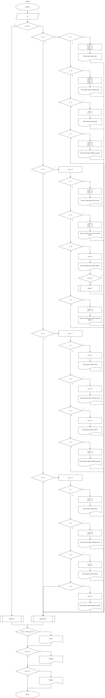
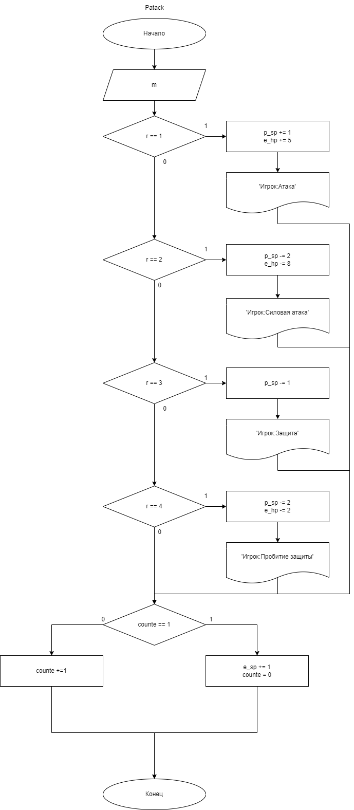
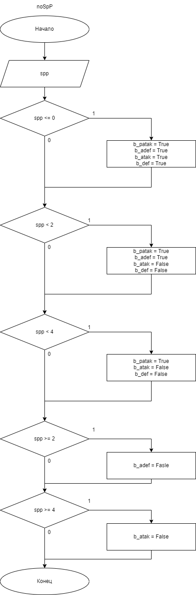
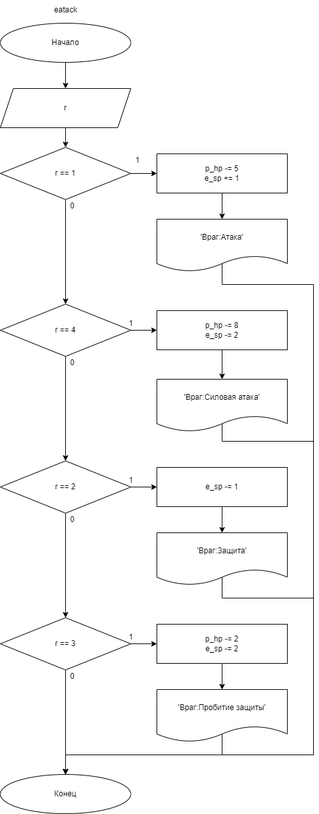
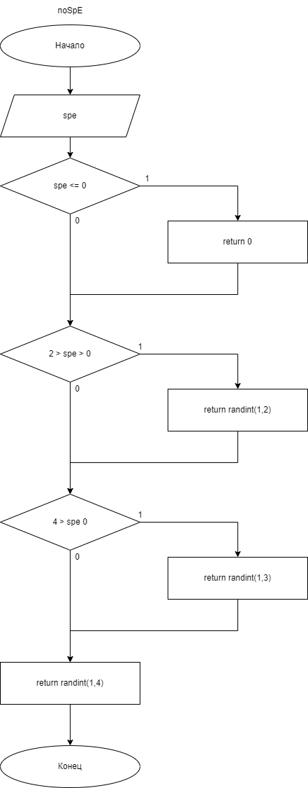

# Практическая работа №5-7 #

### Тема: Создание более сложных интерфейсов. Реализация алгоритмов работы приложения. Подключение к БД и работа с табличными данными.###

### Цель: Применить навыки построения более в KivyMD. Применить навыки написания алгоритмов работы. Применить навыки работы с табличными данными.  ###

#### Ход работы ####

##### Задача: #####

Реализовать текстовую игру. Враг является ботом, его действие выбирается случайно и не должно нарушать правил игры.

##### Интерфейс (KivyMD)

1. Главное меню
    * Кнопка "Новая игра"
    * Кнопка "Рейтинг"
    * Кнопка "Настройки"
2. Экран игры
    * Враг (сверху экрана):
        * Полоска здоровья (слайдер)
        * Полоска выносливости (слайдер)
    * Результат последнего раунда(по центру экрана, реализовать прокрутку):
        * Дейстие врага
        * Дейстие игрока
        * Результат действий
    * Игрок (снизу экрана):
        * Полоска здоровья (слайдер)
        * Полоска выносливости (слайдер)
        * Кнопки (с использованием иконок):
            * Атака
            * Зашита
            * Пробить защиту
            * Силовая атака
        * Прошедшее время
3. Экран настроек:
    * Выбор сложности (влияет на максимальное здоровье противника)


##### Правила игры:

1.	Игроки при старте игры имеют здоровья (25/25), выносливости (4/8):
2.	Игроки в начале раунда в закрытую выбирают одно из четырёх действий:
    * Атака – наносит 5 ед. урона. Успешная атака по врагу добавляет очко         выносливости, иначе отнимает, если очков выносливости нет, пропускаешь ход.
    * Защита (требует 1 очко выносливости) – защищает от простой и силовой атаки. 
    * Пробить защиту (требует 2 очка выносливости) – пробивает защиту врага, нанося 2 ед. урона. Это действие аннулируется любой атакой врага, нанося по вам удвоенный урон. Если враг  выполняет тоже действие, ничего не происходит.
    * Силовая атака (требует 4 очка выносливости) – наносит 8ед. урона. Если игрок выполнил атаку противовес защиты, он пропускает следующий ход. Если игрок выполнил силовую атаку противовес обычной атаки, его атака снижается до 6ед. урона. 
3. У игрока без выносливости спустя два пропущенных хода она востанавливается на 1ед.
4. Как только обе стороны выбрали действие, начинается подсчет результатов раунда.
5. Игра заканчивается после смерти одного из игроков. Результат выводиться диалоговым окном с предложением перезапустить игру или выйти в главное меню.

##### Таблица рекордов

1. Реализовать подключение к БД.
2. Реализовать отправку рекордов.
3. Добавьте в главное меню кнопку перехода на **таблицу** рекордов.
4. Таблица рекордов выгружается с БД.

##### Контрольный пример: #####

1. Пользователь запускает программу
2. Выбирает новая игра
3. Выбирает одно из четырёх действий, и продолжает пока не проиграет или выйграет
4. В появившемся окне пользователь может занести результат в таблицу рекордов и выбирает выйти в главное меню или начать заново
5. В настройках пользователь может выбрать одну из трёх сложностей
6. В рекордах пользователь может увидить своё место и место других пользователей


##### Системный анализ: #####

> Входные данные: `int: r, m, spp, spe`  
> 
> Промежуточные данные: `int: e_sp,e_hp,p_sp,p_hp`, `bool: b_atak, b_patak, b_def, b_adef`
> 
> Выходные данные `-`

##### Блок схемы: #####











##### Код python: #####
```python
from random import randint
from kivymd.app import MDApp
from kivy.lang import Builder
from kivymd.uix.gridlayout import MDGridLayout
from kivymd.uix.dialog import MDDialog
from kivymd.uix.button import MDFloatingActionButton, MDFlatButton
from kivymd.uix.card import MDCard
from kivymd.uix.label import MDLabel
from kivymd.uix.datatables import MDDataTable
from kivy.clock import Clock
from kivy.uix.boxlayout import BoxLayout
from pymysql.cursors import DictCursor
import pymysql


class Content(BoxLayout):
    pass

class DSC(MDGridLayout):
    pass


class GameApp(MDApp):

    def refresh_table(self):
        self.conn.commit()
        with self.conn.cursor() as cursor:
            cursor.execute('SELECT * FROM rating ORDER BY time, result')
            result = cursor.fetchall()

        self.screen.ids.lt_table_chat.children[0].row_data = []
        for row in result:
            self.screen.ids.lt_table_chat.children[0].add_row((
                row['name'],
                row['result'],
                row['time'],
            ))

    def msh_send(self,pname,res,time):
        newtime = f'00:{time}'
        with self.conn.cursor() as cursor:
            cursor.execute(f'insert into rating(name, result, time) values ("{pname}",{res},"{newtime}")')
        self.conn.commit()
        self.refresh_table()


    def switch_dead(self,result):
        self.dialog.dismiss()
        self.dialog=None

        match result:
            case 'main':
                self.switch_screen('main')

            case 'game':
                self.switch_screen('game')
                self.start()


    def show_dialog_dead(self,t):
        if not self.dialog:
            self.dialog=MDDialog(
                title=f'{t} Вы играли на сложности {self.diff}, время игры: {self.screen.ids.timer.text}, всего раундов {self.log}',
                content_cls=Content(),
                type="custom",
                buttons = [
                    MDFlatButton(
                        text='Menu',
                        theme_text_color='Custom',
                        text_color=self.theme_cls.accent_color,
                        on_press=lambda x:  self.switch_dead('main')
                ),
                    MDFlatButton(
                        text='Заново',
                        theme_text_color='Custom',
                        text_color=self.theme_cls.accent_color,
                        on_press=lambda x: self.switch_dead('game')
                    ),
                    MDFlatButton(
                        text='Сохранить результат',
                        theme_text_color='Custom',
                        text_color=self.theme_cls.accent_color,
                        on_press=lambda x: self.msh_send(self.dialog.content_cls.ids.p_name.text, self.log, self.screen.ids.timer.text)
                    ),

                ],

            )
            self.i_timer.cancel()


        self.dialog.open()


    def start(self):

        match self.diff:
            case 'easy':

                self.screen.ids.e_hp.value = 20
            case 'normal':

                self.screen.ids.e_hp.value = 25
            case 'hard':

                self.screen.ids.e_hp.value = 30


        self.tick = 0
        app.screen.ids.timer.text = '00:00'
        for i in range(self.log):
            self.screen.ids.msg_box.remove_widget(self.screen.ids[f'label{i}'])
        self.log = 0
        self.screen.ids.b_patak.disabled = False
        self.screen.ids.e_sp.value = 4
        self.screen.ids.p_sp.value = 4
        self.screen.ids.p_hp.value = 25
        self.i_timer = Clock.schedule_interval(callback=self.timer, timeout=1)

    def timer(self,cloak):
        self.tick += 1
        min = self.tick // 60
        sec = self.tick - min * 60
        self.time = f'{min if min > 9 else "0" + str(min)}:{sec if sec > 9 else "0" + str(sec)}'
        app.screen.ids.timer.text = self.time
        self.noSpP(self.screen.ids.p_sp.value)
        if self.screen.ids.e_sp.value == 0 and self.screen.ids.p_sp.value == 0:
            self.screen.ids.e_sp.value += 1
            self.screen.ids.p_sp.value += 1
            self.screen.ids.b_atak.disabled = False
            self.screen.ids.b_def.disabled = False
        elif self.screen.ids.p_sp.value == 0 and self.screen.ids.e_sp.value > 0:
            self.eatack()
            self.eatack()
            self.screen.ids.p_sp.value += 1
            self.screen.ids.b_atak.disabled = False
            self.screen.ids.b_def.disabled = False

    def FightLog(self,t):
        Label = MDLabel(
            text=t
        )
        self.screen.ids.msg_box.add_widget(Label)
        self.screen.ids[f'label{self.log}'] = Label
        self.log +=1

    def eatack(self):
        r = self.noSpE(self.screen.ids.e_sp.value)
        match r:
            case 1:
                self.screen.ids.p_hp.value -= 5
                self.screen.ids.e_sp.value += 1
                self.FightLog('Враг:Атака')
            case 4:
                self.screen.ids.p_hp.value -= 8
                self.screen.ids.e_sp.value -= 2
                self.FightLog('Враг:Силовая атака')
            case 2:
                self.screen.ids.e_sp.value -= 1
                self.FightLog('Враг:Защита')
            case 3:
                self.screen.ids.p_hp.value -= 2
                self.screen.ids.e_sp.value -= 2
                self.FightLog('Враг:Пробитие защиты')

    def noSpE(self,spe):

        if spe <= 0:
            return 0
        elif 2 > spe > 0:
            return randint(1,2)
        elif 4 > spe > 0:
            return randint(1,3)
        else:
            return randint(1,4)


    def Patack(self, m):
        match m:
            case 1:
                self.screen.ids.p_sp.value += 1
                self.screen.ids.e_hp.value -= 5
                self.FightLog('Игрок:Атака')

            case 2:
                self.screen.ids.p_sp.value -= 2
                self.screen.ids.e_hp.value -= 8
                self.FightLog('Игрок:Силовая атака')

            case 3:
                self.screen.ids.p_sp.value -= 1
                self.FightLog('Игрок:Защита')

            case 4:
                self.screen.ids.p_sp.value -= 2
                self.screen.ids.e_hp.value -= 2
                self.FightLog('Игрок:Пробитие защиты')

        if self.counte == 1:
            self.screen.ids.e_sp.value += 1
            self.counte = 0
        self.counte += 1


    def noSpP(self,spp):

        if spp <= 0:
            self.screen.ids.b_patak.disabled = True
            self.screen.ids.b_adef.disabled = True
            self.screen.ids.b_atak.disabled = True
            self.screen.ids.b_def.disabled = True

        elif spp < 2:
            self.screen.ids.b_patak.disabled = True
            self.screen.ids.b_adef.disabled = True
            self.screen.ids.b_atak.disabled = False
            self.screen.ids.b_def.disabled = False
        elif spp < 4:
            self.screen.ids.b_patak.disabled = True
            self.screen.ids.b_atak.disabled = False
            self.screen.ids.b_def.disabled = False
        if spp >= 2:
            self.screen.ids.b_adef.disabled = False
        if spp >= 4:
            self.screen.ids.b_patak.disabled=False


    def combat(self, m):
        r = self.noSpE(self.screen.ids.e_sp.value)
        if self.screen.ids.e_sp.value != 0:

            match m:
                case 1:
                    if r == 1: #атака на атаку
                        self.screen.ids.e_sp.value += 1
                        self.screen.ids.p_sp.value += 1
                        self.screen.ids.p_hp.value -= 5
                        self.screen.ids.e_hp.value -= 5
                        self.FightLog('Игрок:Атака  Враг:Атака')
                    elif r == 4: #атака на силовую атаку
                        self.screen.ids.p_hp.value -= 6
                        self.screen.ids.p_sp.value += 1
                        self.screen.ids.e_hp.value -= 5
                        self.screen.ids.e_sp.value -= 4
                        self.FightLog('Игрок:Атака  Враг:Силовая атака')
                    elif r == 2: #атака на защиту
                        self.screen.ids.e_sp.value -= 1
                        self.screen.ids.p_sp.value -= 1
                        self.FightLog('Игрок:Атака  Враг:Защита')
                    elif r == 3: #атака на пробитие защиты
                        self.screen.ids.p_sp.value += 1
                        self.screen.ids.e_hp.value -= 10
                        self.screen.ids.e_sp.value -= 2
                        self.FightLog('Игрок:Атака  Враг:Пробитие защиты')


                case 2:
                    self.screen.ids.p_sp.value -= 4
                    if r == 1: #силовая атака на атаку
                        self.screen.ids.e_sp.value += 1
                        self.screen.ids.p_hp.value -= 5
                        self.screen.ids.e_hp.value -= 6
                        self.FightLog('Игрок:Силовая атака  Враг:Атака')
                    elif r == 4: #силовая атака на силовую атаку
                        self.screen.ids.p_hp.value -= 8
                        self.screen.ids.e_hp.value -= 8
                        self.screen.ids.e_sp.value -= 4
                        self.FightLog('Игрок:Силовая атака  Враг:Силовая атака')
                    elif r == 2: #силовая атака на защиту
                        self.screen.ids.e_sp.value -= 1
                        self.FightLog('Игрок:Силовая атака  Враг:Защита')
                        if self.screen.ids.p_sp.value != 0:
                            self.eatack()


                    elif r == 3:  #силовая атака на пробитие защиты
                        self.screen.ids.e_hp.value -= 16
                        self.screen.ids.e_sp.value -= 2
                        self.FightLog('Игрок:Силовая атака  Враг:Пробитие защиты')

                case 3:
                    self.screen.ids.p_sp.value -= 1
                    if r == 1: #защита на атаку
                        self.screen.ids.e_sp.value -= 1
                        self.FightLog('Игрок:Защита  Враг:Атака')

                    elif r == 4: #защита на силовую атаку
                        self.screen.ids.e_sp.value -= 4
                        self.FightLog('Игрок:Защита  Враг:Силовая атака')

                    elif r == 2: #защита на защиту
                        self.screen.ids.e_sp.value -= 1
                        self.FightLog('Игрок:Защита  Враг:Защита')

                    elif r == 3: #защита на пробитие защиты
                        self.screen.ids.p_hp.value -= 2
                        self.screen.ids.e_sp.value -= 2
                        self.FightLog('Игрок:Защита  Враг:Пробитие защиты')

                case 4:
                    self.screen.ids.p_sp.value -= 2
                    if r == 1:  # пробитие защиты на атаку
                        self.screen.ids.e_sp.value += 1
                        self.screen.ids.p_hp.value -= 10
                        self.FightLog('Игрок:Пробитие защиты  Враг:Атака')

                    elif r == 4:  # пробитие защиты на силовую атаку
                        self.screen.ids.p_hp.value -= 16
                        self.screen.ids.e_sp.value -= 4
                        self.FightLog('Игрок:Пробитие защиты  Враг:Силовая атака')

                    elif r == 2:  # пробитие защиты на защиту
                        self.screen.ids.e_sp.value -= 1
                        self.screen.ids.e_hp.value -= 2
                        self.FightLog('Игрок:Пробитие защиты  Враг:Защита')

                    elif r == 3:  # пробитие защиты на пробитие защиты
                        self.screen.ids.e_sp.value -= 2
                        self.FightLog('Игрок:Пробитие защиты  Враг:Пробитие защиты')

            self.noSpP(self.screen.ids.p_sp.value)
        else:

            self.Patack(m)

        if self.screen.ids.e_hp.value <= 0 and self.screen.ids.p_hp.value <= 0:
            self.show_dialog_dead("Ничья")

        elif self.screen.ids.p_hp.value <= 0:
            self.show_dialog_dead("Смерть")
        elif self.screen.ids.e_hp.value <= 0:
            self.show_dialog_dead("Победа")


    def build_config(self, config):
        config.setdefaults(
            'Game', {
                'dif': 'normal',
            }
        )

    def switch_screen(self, screen):
        self.screen.ids.sm.current = screen
        self.i_timer.cancel()
        if screen == 'game':
            self.i_timer.cancel()
            self.start()

    def switch_dif(self, btn):
        dif = None
        match btn.icon[6:]:
            case 'e':
                dif = 'easy'
            case 'n':
                dif = 'normal'
            case 'h':
                dif = 'hard'
        self.diff = dif
        self.config.set('Game', 'dif', dif)
        self.config.write()
        self.screen.ids.dif_btn.icon = btn.icon
        self.dialog.dismiss()
        self.dialog = None


    def show_dialog_dif(self):

        if not self.dialog:

            items = [{'icon':'e', 'dif':'easy'},
                     {'icon':'n', 'dif':'normal'},
                     {'icon':'h', 'dif':'hard'},

            ]
            content = DSC()
            for item in items:
                btn = MDFloatingActionButton(
                    icon='alpha-'+item['icon'],
                    md_bg_color=self.theme_cls.accent_color if item['dif'] == self.config.get('Game','dif') else [.8,.8,.8,1]
                )
                btn.bind(on_press = self.switch_dif)
                content.add_widget(btn)
            self.dialog=MDDialog(
                title='Выберите сложность',
                type='custom',
                content_cls=content
            )
        self.dialog.open()


    def build(self):

        self.dialog = None
        self.log = 0
        self.counte = 0
        self.time = '00:00'
        self.tick = 0

        self.diff = self.config.get('Game', 'dif')
        self.conn = pymysql.connect(
            host='10.49.22.231',
            user='pain',
            password='pain',
            database='rating',
            cursorclass=DictCursor
        )
        if not self.conn:
            self.stop()

        self.item_dif = [{'icon': 'e', 'dif': 'easy'},
                         {'icon': 'n', 'dif': 'normal'},
                         {'icon': 'h', 'dif': 'hard'},
                         ]

        self.dif_start = \
            ['alpha-' + item['icon'] for item in self.item_dif if item['dif'] == self.config.get('Game', 'dif')][0]

        self.screen = Builder.load_file('ui.kv')


        table = MDDataTable(
            use_pagination=True,
            rows_num=5,
            check=True,
            pagination_menu_pos='center',
            column_data=[
                ('Имя', 60),
                ('Ходы', 60),
                ('Время', 60)
            ]
        )

        self.screen.ids.lt_table_chat.add_widget(table)


        self.refresh_table()


        return self.screen


app = GameApp()
app.run()
```
##### Код ui.kv: #####
```python
<DSC>
    size_hint_y:None
    rows: 2
    size_hint_x:1
    height:self.minimum_height
    padding: 20
    spacing:10
    elevation:0


<Content>
    orientation: "vertical"
    spacing: "12dp"
    size_hint_y: None
    height: "120dp"

    MDTextField:
        id:p_name
        hint_text: "Ваше имя"
        mode: 'rectangle'


MDBoxLayout:
    orientation:'vertical'
    MDTopAppBar:
        title:'Главное меню'
        elevation:0
        use_overflow:True
        right_action_items:[['home', lambda x: app.switch_screen('main'),'Главное меню','Главное меню'],['controller-classic', lambda x: app.switch_screen('game'),'Игра','Игра'],['cog', lambda x: app.switch_screen('settings'),'Настройки','Настройки'],['chart-timeline', lambda x: app.switch_screen('rate'),'Рейтинг','Рейтинг']]
    MDScreenManager:
        id:sm
        MDScreen:
            name:"main"
            MDAnchorLayout:
                anchor_x: 'center'
                anchor_y: 'center'
                MDBoxLayout:
                    orientation:'vertical'
                    size_hint:(.75,None)
                    spacing:20
                    MDRectangleFlatButton:
                        text:'Новая игра'
                        size_hint_x:1
                        on_press:app.switch_screen('game')
                        on_press:app.start()
                    MDRectangleFlatButton
                        text:'Рейтинг'
                        size_hint_x:1
                        on_press:app.switch_screen('rate')
                    MDRectangleFlatButton
                        text:'Настройки'
                        size_hint_x:1
                        on_press:app.switch_screen('settings')
        MDScreen:
            name:'settings'
            MDScrollView:
                MDList:
                    OneLineAvatarIconListItem:
                        text:'Сложность'
                        IconLeftWidget:
                            icon: 'brain'
                        IconRightWidget:
                            id:dif_btn
                            icon:app.dif_start

                            on_press:
                                app.show_dialog_dif()


        MDScreen:
            name:'game'
            MDBoxLayout:
                orientation:'vertical'
                MDBoxLayout:
                    size_hint:1,None
                    pos_hint: {'top':1}
                    padding: [20,10, 20, 0]
                    height: self.minimum_height
                    MDLabel:
                        text:f'Health points: {e_hp.value}'
                        halign:'center'
                        valign:'center'
                    MDLabel:
                        text:f'Stamina points: {e_sp.value}'
                        halign:'center'
                        valign:'center'
                MDBoxLayout:
                    size_hint:1,None
                    pos_hint: {'top':1}
                    padding: [20,10, 20, 5]
                    height: self.minimum_height


                    MDSlider:
                        id:e_hp
                        min: 0
                        max: 30
                        value: 25
                        step:1
                        color: [1,0,0,1]

                    MDSlider:
                        id:e_sp
                        min: 0
                        max: 8
                        value: 4
                        step:1
                        color: [1,1,0,1]


                MDBoxLayout:
                    orientation: 'vertical'
                    padding: [125, 10, 125, 80]
                    size_hint: 1, 1

                    MDLabel:
                        id:timer
                        text:'00:00'
                        halign: "center"

                    MDScrollView:
                        id:msg_scroll
                        size_hint:1,1
                        MDBoxLayout:
                            id:msg_box
                            orientation: 'vertical'
                            size_hint: 1, None
                            height: self.minimum_height
                            spacing:20
                            padding:10

                MDBoxLayout:
                    size_hint:1,None
                    pos_hint: {'bottom':1}
                    padding: [20,0, 20, 15]
                    height: self.minimum_height
                    MDLabel:
                        text:f'Health points: {p_hp.value}'
                        halign:'center'
                        valign:'center'
                    MDLabel:
                        text:f'Stamina points: {p_sp.value}'
                        halign:'center'
                        valign:'center'


                MDBoxLayout:
                    size_hint:1,None
                    pos_hint: {'bottom':1}
                    padding: [20,0, 20, 10]
                    height: self.minimum_height
                    MDSlider:
                        id:p_hp
                        min: 0
                        max: 25
                        value: 25
                        step:1
                        color: [1,0,0,1]

                    MDSlider:
                        id:p_sp
                        min: 0
                        max: 8
                        value: 4
                        step:1
                        color: [1,1,0,1]

                MDAnchorLayout:
                    anchor_x: 'center'
                    anchor_y: 'bottom'
                    size_hint:None, None
                    height:85
                    MDBoxLayout:
                        size_hint:1,None
                        pos_hint: {'bottom':1}
                        spacing:10
                        padding: [130,0, 20,15]
                        height: self.minimum_height
                        MDFillRoundFlatIconButton:
                            id:b_atak
                            text:'Атака'
                            icon:'sickle'
                            disabled: False
                            on_press:
                                app.combat(1)

                        MDFillRoundFlatIconButton:
                            id:b_patak
                            text:'Силовая атака'
                            icon:'nuke'
                            disabled: False
                            on_press:
                                app.combat(2)
                        MDFillRoundFlatIconButton:
                            id:b_adef
                            text:'Пробить защиту'
                            icon:'shield-off'
                            disabled: False
                            on_press:
                                app.combat(4)
                        MDFillRoundFlatIconButton:
                            id:b_def
                            text:'Защита'
                            icon:'shield-cross'
                            disabled: False
                            on_press:
                                app.combat(3)

        MDScreen:
            name:'rate'
            MDBoxLayout:
                orientation:'vertical'
                MDBoxLayout:
                    padding: [20, 95, 20, 20]
                    spacing: 10
                    orientation: 'vertical'
                    size_hint: 1, 1
                    height: self.minimum_height
                    MDBoxLayout:
                        id: lt_table_chat
```
### Результат работы программы: ###


