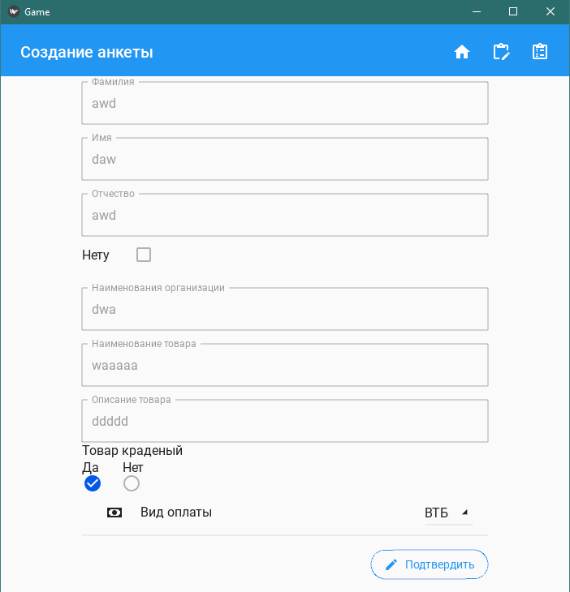

# Практическая работа №8 #


### Тема: Создание простых форм. Запись и чтение результатов из файла###

### Цель: Применить навыки создание форм и работы с файлами  ###

#### Ход работы ####

##### Задача: #####

Реализуйте анкету продажи товара

##### Контрольный пример: #####

1. Пользователь запускает программу
2. Выбирает Создать анкету
3. Вводит данные в поля
4. Нажимает кнопку Подтвердить
5. Сверху нажимает кнопку Посмотр анкеты


##### Системный анализ: #####

> Входные данные: `str: t_sname.text, t_name.text, t_mname.text, t_org.text, t_tov.text, t_opstov.text`, `bool: da.active, loh.active`  
> 
> Промежуточные данные: `-`
> 
> Выходные данные `str line`

##### Блок схемы: #####


##### Код python: #####
```python
from kivy.config import Config
Config.set("graphics", "width", 700)
Config.set("graphics", "height", 700)
from kivymd.app import MDApp
from kivy.lang import Builder
from kivymd.uix.gridlayout import MDGridLayout
from kivy.uix.boxlayout import BoxLayout
from kivymd.uix.menu import MDDropdownMenu
from kivymd.uix.list import IRightBodyTouch
from kivymd.uix.anchorlayout import MDAnchorLayout
from kivymd.uix.snackbar import BaseSnackbar
from kivy.properties import StringProperty, ListProperty
from kivy.core.window import Window

from kivymd.uix.card import MDCard


class CSnackbar(BaseSnackbar):
    icon = StringProperty(None)
    text = StringProperty(None)
    color = ListProperty(None)

class Content(BoxLayout):
    pass

class DSC(MDGridLayout):
    pass

class MD3Card(MDCard):
    text = StringProperty()


class IRightContainer(IRightBodyTouch, MDAnchorLayout):
    adaptive_height = True

class GameApp(MDApp):
    def pro(self):
        return self.screen.ids
    def textcheck(self):
        self.count = 0
        file = open('text','r',encoding='utf-8')
        for line in file:
            if self.count < 3:
                self.screen.ids.box.add_widget(
                    MD3Card(

                        line_color=(0.2, 0.2, 0.2, 0.8),
                        style="filled",
                        text=line,
                        md_bg_color="#373e4d",
                        shadow_softness=12,
                        shadow_offset=(0, 2),
                    )

                )
            elif self.count == 3:
                self.screen.ids.box2.add_widget(
                    MD3Card(

                        line_color=(0.2, 0.2, 0.2, 0.8),
                        style="filled",
                        text=line,
                        md_bg_color="#373e4d",
                        shadow_softness=12,
                        shadow_offset=(0, 2),
                    )

                )
            elif 7 > self.count >= 4:
                self.screen.ids.box3.add_widget(
                    MD3Card(

                        line_color=(0.2, 0.2, 0.2, 0.8),
                        style="filled",
                        text=line,
                        md_bg_color="#373e4d",
                        shadow_softness=12,
                        shadow_offset=(0, 2),
                    )

                )
            elif self.count == 7:
                self.screen.ids.box4.add_widget(
                    MD3Card(

                        line_color=(0.2, 0.2, 0.2, 0.8),
                        style="filled",
                        text=line,
                        md_bg_color="#373e4d",
                        shadow_softness=12,
                        shadow_offset=(0, 2),
                    )

                )
            self.count+=1

        file.close()

    def textadd(self):
        file = open('text','w',encoding='utf-8')
        file.write(f'Фамилия: {self.pro().t_sname.text}\nИмя: {self.pro().t_name.text}\n')
        if self.pro().loh.active == True:
            file.write(f'Отчество: Нет\n')
        else:
            file.write(f'Отчество: {self.pro().t_mname.text}\n')
        file.write(f'Организация: {self.pro().t_org.text}\nТовар: {self.pro().t_tov.text}\nОписание: {self.pro().t_opstov.text}\n')
        if self.pro().da.active == True:
            file.write(f'Товар краденый\n')
        else:
            file.write(f'Товар не краденый\n')
        file.write(f'Вид оплаты: {self.config.get("App", "hren")}\n')
        file.close()
        self.notifi()

    def notifi(self):
        notify = CSnackbar(
            text='Анкета создана',
            icon='account-tie-hat',
            snackbar_x=10,
            snackbar_y=10,
            color=[0, 1, 0, 1]
        )

        notify.size_hint_x = ((Window.width - 20) / Window.width)
        notify.open()


    def netpapi(self):
        if self.screen.ids.loh.active==True:
            self.screen.ids.t_mname.disabled = True
        else:
            self.screen.ids.t_mname.disabled = False

    def switch_hren(self, hren):
        self.screen.ids.drop_hren.set_item(hren)
        self.config.set('App', 'hren', hren)
        self.config.write()
        self.drop_hren.dismiss()

    def build_config(self, config):
        config.setdefaults(
            'App', {
                'hren':'QIWI'
            }
        )

    def switch_screen(self, screen):
        self.screen.ids.sm.current = screen
        match screen:
            case 'main':
                self.screen.ids.nav.title = 'Главное меню'
            case 'create':
                self.screen.ids.nav.title = 'Создание анкеты'
            case 'check':
                self.screen.ids.nav.title = 'Просмотр анкеты'
                self.textcheck()

    def build(self):
        self.screen = Builder.load_file('ui.kv')


        self.screen.ids['cd'] = MD3Card


        self.drop_hren = MDDropdownMenu(
            caller=self.screen.ids.drop_hren,
            items=[
                {
                    'viewclass': 'OneLineListItem',
                    'text': hren,
                    'on_release': lambda x=hren: self.switch_hren(x)
                } for hren in  ['Наличные',
                                'Сбер',
                                'ВТБ',
                                'QIWI',
                                'Натурой',
                                ]
            ],
            width_mult=2,
            position='center'
        )
        return self.screen


app = GameApp()
app.run()
```
##### Код ui.kv: #####
```python
<DSC>
    size_hint_y:None
    rows: 2
    size_hint_x:1
    height:self.minimum_height
    padding: 20
    spacing:10
    elevation:0

<CSnackbar>:
    MDIcon:
        icon: root.icon
        theme_text_color: 'Custom'
        text_color: root.color
        pos_hint:{'center_y':.5}

    MDLabel:
        text: root.text
        theme_text_color: 'Custom'
        text_color: [1,1,1,1]
        pos_hint:{'center_y':.5}


<Content>
    orientation: "vertical"
    spacing: "12dp"
    size_hint_y: None
    height: "120dp"

    MDTextField:
        id:p_name
        hint_text: "Ваше имя"
        mode: 'rectangle'

<Check@MDCheckbox>:
    group: 'group'
    size_hint: None, None
    size: dp(48), dp(48)


<MD3Card>

    padding: 4
    size_hint: None, None
    size: "220dp", "100dp"

    MDRelativeLayout:

        MDLabel:
            id: label
            text: root.text
            adaptive_size: True
            color: '#fafafa'
            pos: "5dp", "12dp"
            bold: True


MDBoxLayout:
    orientation:'vertical'
    MDTopAppBar:
        id:nav
        title:'Главное меню'
        elevation:0
        use_overflow:True
        right_action_items:[['home', lambda x: app.switch_screen('main'),'Главное меню','Главное меню'],['clipboard-edit-outline', lambda x: app.switch_screen('create'),'Создать анкету','Создать анкету'],['clipboard-list-outline', lambda x: app.switch_screen('check'),'Просмотр анкеты','Просмотр анкеты']]
    MDScreenManager:
        id:sm
        MDScreen:
            name:"main"
            MDAnchorLayout:
                anchor_x: 'center'
                anchor_y: 'center'
                MDBoxLayout:
                    orientation:'vertical'
                    size_hint:(.75,None)
                    spacing:20
                    MDRectangleFlatButton:
                        text:'Создание анкеты'
                        size_hint_x:1
                        on_press:app.switch_screen('create')

                    MDRectangleFlatButton
                        text:'Просмотр анкеты'
                        size_hint_x:1
                        on_press:
                            app.switch_screen('check')
                            app.textcheck()

        MDScreen:
            name:'create'
            MDAnchorLayout:
                anchor_y:'top'

                MDBoxLayout:
                    spacing: 10
                    orientation: 'vertical'

                    padding: [100, 0, 100, 0]
                    size_hint: 1, None
                    height: self.minimum_height
                    MDTextField:
                        id:t_sname
                        hint_text: "Фамилия"
                        mode: 'rectangle'
                        size_hint_y: None

                    MDTextField:
                        id:t_name
                        hint_text: "Имя"
                        mode: 'rectangle'
                        size_hint_y: None
                    MDTextField:
                        id:t_mname
                        hint_text: "Отчество"
                        mode: 'rectangle'
                        size_hint_y: None

                    MDBoxLayout:
                        orientation: 'horizontal'
                        size_hint: None, None
                        height: self.minimum_height
                        padding: [0, -11, 0, 0]
                        MDLabel:
                            text:'Нету'
                        MDCheckbox:
                            id:loh
                            size_hint: None, None
                            size: "48dp", "48dp"
                            pos_hint: {'center_x': .5, 'center_y': .5}
                            on_active:
                                app.netpapi()

                    MDTextField:
                        id:t_org
                        hint_text: "Наименования организации"
                        mode: 'rectangle'
                        size_hint_y: None
                    MDTextField:
                        id:t_tov
                        hint_text: "Наименование товара"
                        mode: 'rectangle'
                        size_hint_y: None
                    MDTextField:
                        id:t_opstov
                        hint_text: "Описание товара"
                        mode: 'rectangle'
                        size_hint_y: None
                    MDLabel:
                        text:'Товар краденый'

                    MDBoxLayout:
                        size_hint: None, None
                        height: self.minimum_height
                        padding: [0, 11, 0, 0]
                        MDLabel:
                            text:'Да'
                        MDLabel:
                            text:'Нет'
                    MDBoxLayout:
                        padding: [-11, 11, 0, 0]
                        Check:
                            id: da
                            active: True
                            group: 'group'
                            size_hint: None, None
                            size: dp(48), dp(48)

                            pos_hint: {'center_x': .4, 'center_y': .9}


                        Check:
                            id:net
                            group: 'group'
                            size_hint: None, None
                            size: dp(48), dp(48)

                            pos_hint: {'center_x': .6, 'center_y': .9}


                    MDList:
                        OneLineAvatarIconListItem:
                            text:'Вид оплаты'
                            IconLeftWidget:
                                icon:'cash'
                            IRightContainer:
                                MDDropDownItem:
                                    id:drop_hren
                                    text: app.config.get('App','hren')
                                    on_press:app.drop_hren.open()


                    MDRoundFlatIconButton:
                        pos_hint: {'right':1,'top':1,}
                        text: 'Подтвердить'
                        icon: 'pencil'
                        on_press:
                            app.textadd()


        MDScreen:
            name:'check'
            MDAnchorLayout:
                anchor_y:'top'

                MDBoxLayout:
                    orientation: "horizontal"
                    id: box
                    size_hint: 1, None
                    height: self.minimum_height
                    spacing:5
                    padding:[15,50,20,0]
                MDBoxLayout:
                    orientation: "vertical"
                    id: box2
                    spacing:5
                    size_hint: 1, None
                    height: self.minimum_height
                    padding:[240,170,100,0]

                MDBoxLayout:
                    orientation: "horizontal"
                    id: box3
                    spacing:5
                    size_hint: 1, None
                    height: self.minimum_height
                    padding:[15,290,20,0]

                MDBoxLayout:
                    orientation: "vertical"
                    id: box4
                    spacing:5
                    size_hint: 1, None
                    height: self.minimum_height
                    padding:[240,410,100,0]
```
### Результат работы программы: ###





