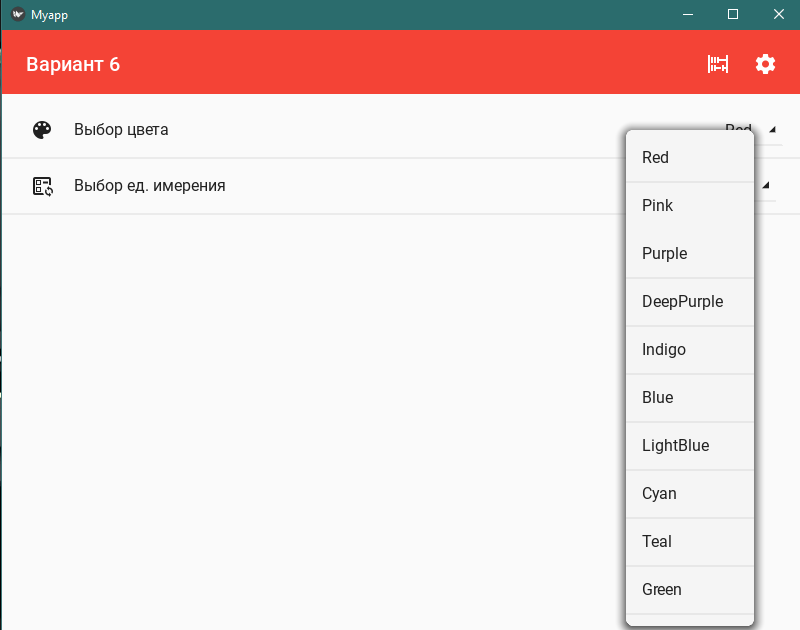

# Практическая работа №4 #

### Тема:  ###

### Цель:  ###

#### Ход работы ####

##### Задача: #####

>

##### Контрольный пример: #####

> Пользователь запускает программу.
> 
> Пользователь вводит в поля параметры стен `5, 12, 6`
> 
> Пользователь вводит в поля параметры окна `2, 1`
> 
> Пользователь вводит в поля параметры дверного проема `3, 2`
> 
> Нажимает на кнопку Посчитать
>
> Получает уведомление 172 кв метра
> 
> Пользователь нажимает на кнопку настройки сверху справа
> 
> Пользователь переходит на окно настроек
> 
> Пользователь нажимает на список цветов и выбирает нужный цвет приложения
> 
> Пользователь нажимает на список единиц измерения и выбирает другую единицу измерения например см
> 
> Пользователь нажимает на кнопку Главный экран сверху справо
> 
> Пользователь переходит на главный экран
> 
> Пользователь нажимает на кнопку Посчитать
> 
> Пользователь получает уведомление 1720000 кв сантиметра


##### Системный анализ: #####

> Входные данные: `str: rm_h, rm_w, rm_l, win_w, win_h, dr_w, dr_h`  
> 
> Промежуточные данные: `int: P, W_S, D_S`, `str check`
> 
> Выходные данные `int S`

##### Блок схемы: #####


##### Код python: #####
```python
from kivymd.app import MDApp
from kivy.lang import Builder
from kivymd.uix.menu import MDDropdownMenu
from kivymd.uix.list import IRightBodyTouch
from kivymd.uix.anchorlayout import MDAnchorLayout
from kivymd.uix.snackbar import Snackbar
from kivy.core.window import Window


class IRightContainer(IRightBodyTouch, MDAnchorLayout):
    adaptive_height = True

class MyappApp(MDApp):
    def cal(self,rm_h:str,rm_w:str,rm_l:str,win_w:str,win_h:str,dr_w:str,dr_h:str):
        try:
            r_h=int(rm_h)
            r_w=int(rm_w)
            r_l=int(rm_l)
            w_w=int(win_w)
            w_h=int(win_h)
            d_w=int(dr_w)
            d_h=int(dr_h)
            self.P = (r_w+r_l)*2
            self.W_S = w_w * w_h
            self.D_S = d_h * d_w
            self.S = (self.P * r_h)-(self.W_S+self.D_S)
            self.check = self.config.get('App', 'hren')
            if(self.check=='m'):
                notify = Snackbar(
                    text=f"{str(self.S)} кв метров",
                    snackbar_x=10,
                    snackbar_y=10
                )
                notify.size_hint_x = ((Window.width - 20) / Window.width)
                notify.open()
            elif(self.check=='km'):
                self.S /= 1000000
                notify = Snackbar(
                    text=f"{self.S} кв километров",
                    snackbar_x=10,
                    snackbar_y=10
                )
                notify.size_hint_x = ((Window.width - 20) / Window.width)
                notify.open()
            elif(self.check=='cm'):
                self.S *= 10000
                notify = Snackbar(
                    text=f"{self.S} кв сантиметров",
                    snackbar_x=10,
                    snackbar_y=10
                )
                notify.size_hint_x = ((Window.width - 20) / Window.width)
                notify.open()
        except Exception:
            notify = Snackbar(
                text=f"Ищи ошибки",
                snackbar_x=10,
                snackbar_y=10
            )
            notify.size_hint_x = ((Window.width - 20) / Window.width)
            notify.open()


    def switch_palette(self, color):
        self.theme_cls.primary_palette = color
        self.config.set('App', 'primary_palette', color)
        self.config.write()
        self.drop_palette.dismiss()

    def switch_hren(self, hren):
        self.screen.ids.drop_hren.set_item(hren)
        self.config.set('App', 'hren', hren)
        self.config.write()
        self.drop_hren.dismiss()

    def switch_screen(self, screen):
        self.screen.ids.sm.current = screen

    def build_config(self, config):
        config.setdefaults(
            'App', {
                'primary_palette': 'Orange',
                'hren':'m'
            }
        )

    def build(self):
        self.screen = Builder.load_file('ui.kv')
        self.theme_cls.primary_palette = self.config.get('App', 'primary_palette')
        self.drop_palette = MDDropdownMenu(
            caller=self.screen.ids.drop_palette,
            items=[
                {
                    'viewclass': 'OneLineListItem',
                    'text': color,
                    'on_release': lambda x=color: self.switch_palette(x)
                } for color in ['Red',
                                'Pink',
                                'Purple',
                                'DeepPurple',
                                'Indigo',
                                'Blue',
                                'LightBlue',
                                'Cyan',
                                'Teal',
                                'Green',
                                'LightGreen',
                                'Lime',
                                'Yellow',
                                'Amber',
                                'Orange',
                                'DeepOrange',
                                'Brown',
                                'Gray',
                                'BlueGray'
                                ]
            ],
            width_mult=2,
            position='center'
        )
        self.hren = self.config.get('App','hren')
        self.drop_hren = MDDropdownMenu(
            caller=self.screen.ids.drop_hren,
            items=[
                {
                    'viewclass': 'OneLineListItem',
                    'text': hren,
                    'on_release': lambda x=hren: self.switch_hren(x)
                } for hren in  ['m',
                                'cm',
                                'km',
                                ]
            ],
            width_mult=2,
            position='center'
        )

        return self.screen


app = MyappApp()
app.run()
```
##### Код ui.kv: #####
```python
MDBoxLayout:
    orientation:'vertical'
    MDTopAppBar:
        title:'Вариант 6'
        elevation:0
        use_overflow:True
        right_action_items:[['abacus', lambda x: app.switch_screen('main'),'Главный экран','Главный экран'],['cog', lambda x: app.switch_screen('settings'),'Настройки','Настройки']]
    MDScreenManager:
        id:sm
        MDScreen:
            name:"main"
            MDBoxLayout:
                orientation:'vertical'
                pos_hint:{'top':1}
                padding:[20,20,20,0]
                spacing:8
                size_hint:1,None
                height: self.minimum_height
                MDTextField:
                    id:rm_h
                    mode:'rectangle'
                    size_hint_y:None
                    hint_text:'Высота стен'
                MDTextField:
                    id:rm_l
                    mode:'rectangle'
                    size_hint_y:None
                    hint_text:'Длина стен'
                MDTextField:
                    id:rm_w
                    mode:'rectangle'
                    size_hint_y:None
                    hint_text:'Ширина стен'
                MDTextField:
                    id:win_h
                    mode:'rectangle'
                    size_hint_y:None
                    hint_text:'Высота окна'
                MDTextField:
                    id:win_w
                    mode:'rectangle'
                    size_hint_y:None
                    hint_text:'Ширина окна'
                MDTextField:
                    id:dr_h
                    mode:'rectangle'
                    size_hint_y:None
                    hint_text:'Высота дверного проема'
                MDTextField:
                    id:dr_w
                    mode:'rectangle'
                    size_hint_y:None
                    hint_text:'Ширина дверного проема'
                MDAnchorLayout:
                    anchor_x:'right'
                    anchor_y:'top'
                    size_hint_y:None
                    MDRoundFlatIconButton:
                        text: 'Посчитать'
                        icon:'alarm-panel'
                        on_press:
                            app.cal(rm_h.text,rm_w.text,rm_l.text,win_w.text,win_h.text,dr_w.text,dr_h.text)

        MDScreen:
            name:'settings'
            MDScrollView:
                MDList:
                    OneLineAvatarIconListItem:
                        text:'Выбор цвета'
                        IconLeftWidget:
                            icon:'palette'
                        IRightContainer:
                            MDDropDownItem:
                                id:drop_palette
                                text: app.theme_cls.primary_palette
                                on_press:app.drop_palette.open()
                    OneLineAvatarIconListItem:
                        text:'Выбор ед. имерения'
                        IconLeftWidget:
                            icon:'ballot-recount-outline'
                        IRightContainer:
                            MDDropDownItem:
                                id:drop_hren
                                text: app.config.get('App','hren')
                                on_press:app.drop_hren.open()
```
### Результат работы программы: ###





